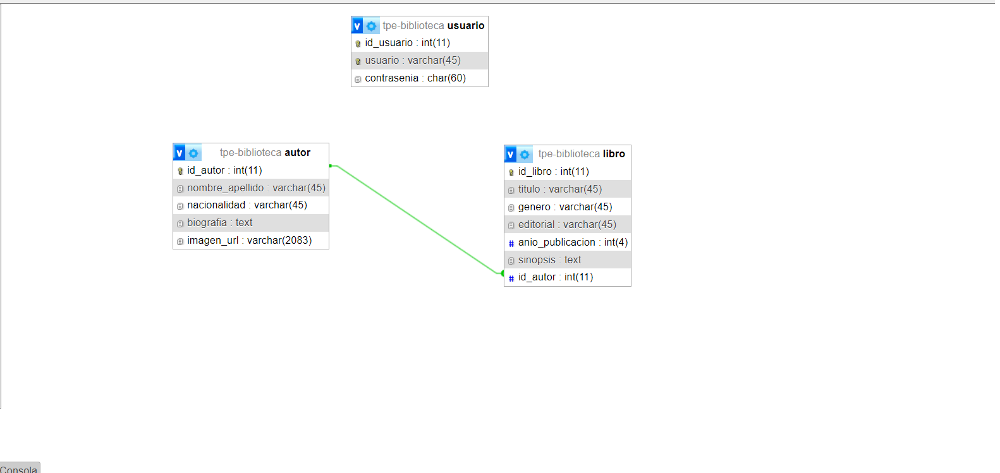

# Dominio del trabajo
TPE WEB 2
Integrantes: Guaspari Elisa, Rodríguez Gómez Claribel.

El objetivo del sistema es proporcionar una plataforma integral para gestionar la información de autores, libros y usuarios dentro de una biblioteca. Este sistema facilita la administración de datos relacionados con los libros disponibles, los autores que los escriben y los usuarios que interactúan con la biblioteca mediante préstamos de libros.
El archivo .sql muestra en primera instancia la tabla autor y la tabla libro (con registros insertados de ejemplo), con una relación 1 a n como lo solicitaba el TPE. Más adelante será adicionada la tabla usuario utilizando el mismo modelo de datos.

## Diagrama

